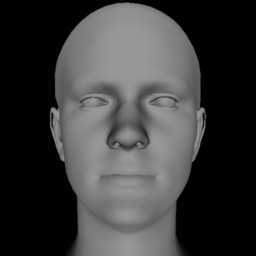

# Simple Camera

Minimum dependencies library for fast rendering of triangle meshes.

## Setup

### Install with pip:
```console
foo@bar:~$ pip install simple-camera
```

### or manually:
Inside cloned repository run the following:

```console
foo@bar:~$ pip install -r requirements.txt
foo@bar:~$ python setup.py install
```

## Usage
```python
from simple_camera import render_perspective_camera

img = render_perspective_camera(vertices, faces,
                                width=256, height=256, 
                                angles=[0,0,0], translation=[0,0,0], 
                                scale=0.75) 
Image.fromarray(img)
```


## Acknowledgements
* This library is based on [Face3D](https://github.com/YadiraF/face3d) code.
